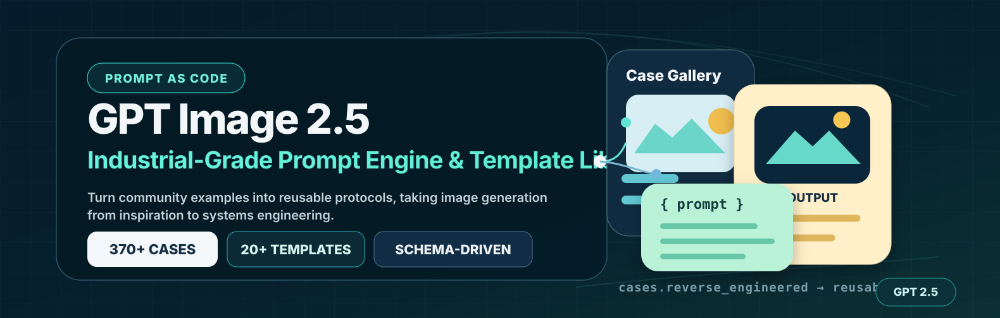
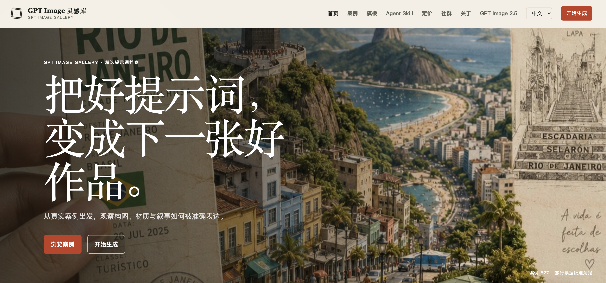
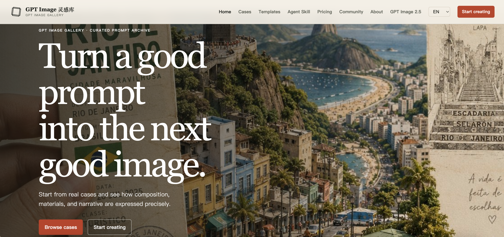
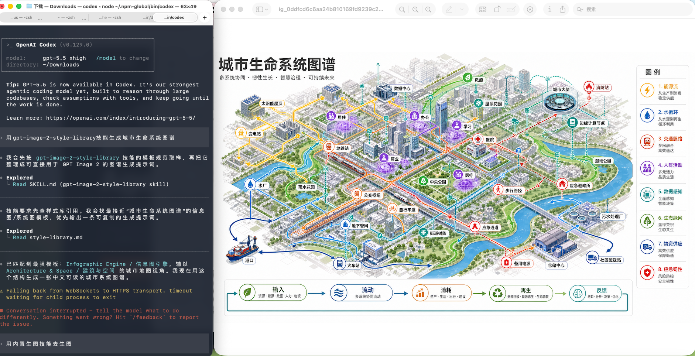
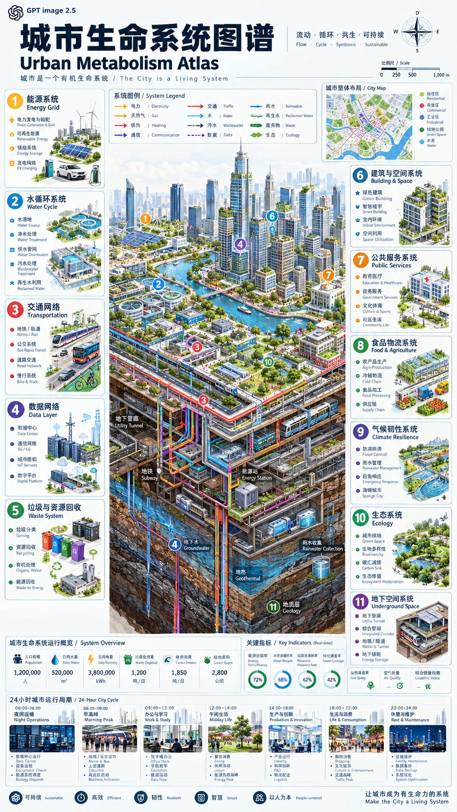
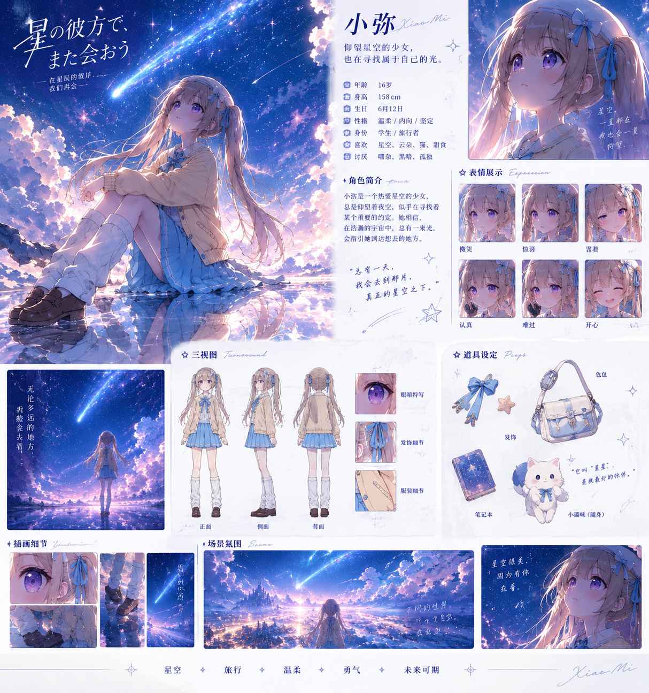
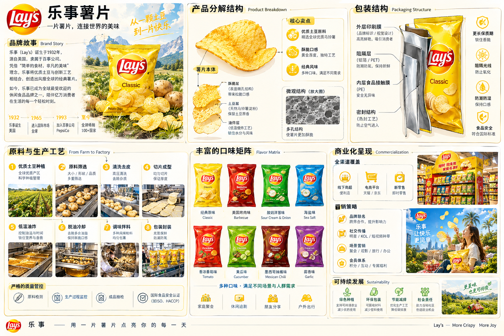

<p align="center"></p>

<h3 align="center">Prompt as GPT-Image2.5: An Industrial-Grade Prompt Engine and Template Library with 20+ Production-Ready Templates</h3>

<p align="center">
  <a href="https://github.com/KeKe-Li/gpt-2-image"></a>
  <a href="https://github.com/KeKe-Li/gpt-2-image"></a>
  <a href="https://github.com/KeKe-Li/gpt-2-image"></a>
</p>

<p align="center">
  <a href="https://trendshift.io/repositories/28623?utm_source=repository-badge&amp;utm_medium=badge&amp;utm_campaign=badge-repository-28623">
    
  </a>
</p>

<p align="center">
  <a href="./README.zh-CN.md">简体中文</a> | <strong>English</strong> 
</p>

## GPT Image 2.5 Hub

[Open the 2.5 Hub](https://gpt-image2.canghe.ai/gpt-image-2-5/): learn about Sunburst and Flare, then explore old-versus-new model comparisons through shared prompts, slider and side-by-side views, full-size originals, and generation parameters.

- [Sunburst](https://developers.openai.com/api/docs/models/gpt-image-2.5-sunburst): designed for detailed image generation and editing.
- [Flare](https://developers.openai.com/api/docs/models/gpt-image-2.5-flare): designed for fast, high-quality everyday image generation.

The hub runs independently, while the existing GPT-Image2 cases, templates, Skill, and online generation entry points remain available. This update does not enable GPT Image 2.5 generation on the website.

<p align="center">
  <a href="https://github.com/KeKe-Li/gpt-2-image">
    
  </a>
</p>

## 🌐 Visual Website

Browse the collection through a product-style experience: open full-size images, copy complete prompts, filter by style or scenario, configure a personal APIMart Key or sign in to test generation, and quickly jump back to the source case on GitHub.

<p align="center">
  <a href="https://gpt-image2.canghe.ai/">
    
  </a>
</p>

## Community Group

Join the GPT-Image2 community group to share prompts, creative techniques, and practical experience with other users.

Scan the QR code below to receive project updates, new cases, and practical tutorials.

<p align="center">
  
</p>


## ⚡️ Project Vision

With GPT-Image2 fully available, the central question in AI image generation has shifted from "Can it generate an image?" to "Can it generate images reliably, controllably, and repeatedly?" This project focuses on reverse-engineering scattered examples into Prompt-as-Code assets that are better suited to agents and automated workflows, rather than simply collecting prompts.

The core goal is simple: compress prose-style prompts into structured protocols. When you need batch generation, a template system, or production integration, this approach is more valuable than a loose pile of examples.

- 🧱 Atomic schemas: break subjects, lighting, materials, typography, and other visual elements into composable components
- ⚙️ Workflow-friendly: designed for agents, scripts, and automation systems instead of manual copy-and-paste alone
- 🧬 Structured control: improve control over layout, copy, and information hierarchy wherever possible

## 📖 Quick Links

- [Complete case overview](docs/gallery.md)
- [Case Gallery Part 1: Cases 1-165 (with gaps)](docs/gallery-part-1.md)
- [Case Gallery Part 2: Cases 166-544 (with gaps)](docs/gallery-part-2.md)
- [Industrial-grade prompt templates and troubleshooting guide](docs/templates.md#section-templates)
- [Agent Skill: GPT-Image2 style library](agents/skills/gpt-image-2-style-library/SKILL.md)
- [MIT License](LICENSE)
- [Full disclaimer](docs/disclaimer.md#section-disclaimer)

## 🗂️ Category Overview

Start with the case gallery to find the visual category you need, then use the prompt templates to break that category into reusable structures.

### 🖼️ Case Categories

<table>
  <tr>
    <td width="33%" valign="top" align="center">
      <p><strong>📊 Charts and Information Visualization</strong><br><sub>53 cases</sub></p>
      <a href="docs/gallery.md#cat-infographic"></a><br>
      <sub>Infographics, knowledge graphs, technical explanations, and structured diagrams.</sub><br>
      <a href="docs/gallery.md#cat-infographic"><strong>View cases</strong></a>
    </td>
    <td width="33%" valign="top" align="center">
      <p><strong>📰 Posters and Typography</strong><br><sub>90 cases</sub></p>
      <a href="docs/gallery.md#cat-poster"></a><br>
      <sub>Event posters, covers, typographic visuals, and layout-driven compositions.</sub><br>
      <a href="docs/gallery.md#cat-poster"><strong>View cases</strong></a>
    </td>
  </tr>
</table>

### 🧩 Prompt Template Categories

<details open>
<summary><strong>Template Page 1 / 4: Design and Information</strong></summary>

| Category | Template | Core capabilities |
|---|---|---|
| 🧩 UI and Interfaces | [View prompt](docs/templates.md#tpl-ui) | Components, page hierarchy, screenshot-like finish |
| 📊 Charts and Information Visualization | [View prompt](docs/templates.md#tpl-infographic) | Modules, arrows, data structures, readability |
| 📰 Posters and Typography | [View prompt](docs/templates.md#tpl-poster) | Layout, titles, people, and visual impact |

</details>

<details>
<summary><strong>Template Page 2 / 4: Commerce and Space</strong></summary>

| Category | Template | Core capabilities |
|---|---|---|
| 🛍️ Products and E-commerce | [View prompt](docs/templates.md#tpl-product) | Product benefits, packaging, detail-page structure |
| 🏷️ Branding and Logos | [View prompt](docs/templates.md#tpl-brand) | Logos, brand identity, touchpoint systems |
| 🏛️ Architecture and Space | [View prompt](docs/templates.md#tpl-architecture) | Perspective, materials, indoor and outdoor lighting |

</details>

<details>
<summary><strong>Template Page 3 / 4: Imagery and Characters</strong></summary>

| Category | Template | Core capabilities |
|---|---|---|
| 📷 Photography and Realism | [View prompt](docs/templates.md#tpl-photo) | Lenses, lighting, realistic textures |
| 🎨 Illustration and Art | [View prompt](docs/templates.md#tpl-illustration) | Brushwork, materials, artistic styles |
| 🧍 People and Characters | [View prompt](docs/templates.md#tpl-character) | Character design, pose sheets, character consistency |

</details>

<details>
<summary><strong>Template Page 4 / 4: Narrative and Extensions</strong></summary>

| Category | Template | Core capabilities |
|---|---|---|
| 🎬 Scenes and Storytelling | [View prompt](docs/templates.md#tpl-scene) | Storyboards, world-building, emotional development |
| 🏮 Historical and Traditional Chinese Themes | [View prompt](docs/templates.md#tpl-history) | Dynasties, clothing, scroll-style narratives |
| 📚 Documents and Publishing | [View prompt](docs/templates.md#tpl-document) | Page systems, tables of contents, layout standards |
| 🧪 Other Use Cases | [View prompt](docs/templates.md#tpl-other) | Mixed tasks, experiments, specialized outputs |

</details>

## 🤖 Agent Skill

The repository includes an agent skill that uses the shared style-library data to help Claude Code, Codex, and other agents select GPT-Image2 templates, categories, styles, and scenario tags.

Packages: [npm](https://www.npmjs.com/package/gpt-image-2-style-library) / [GitHub Packages](https://github.com/KeKe-Li/gpt-2-image/pkgs/npm/gpt-image-2-style-library)

<p align="center">
  
</p>

<p align="center"><sub>Example: generating a "City Metabolism System Map" with gpt-image-2-style-library.</sub></p>

### One-Command Agent Installation

Recommended for Claude Code, Codex, Cursor, and other local agents supported by [`skills`](https://www.npmjs.com/package/skills):

```bash
npx skills add KeKe-Li/gpt-2-image --skill gpt-image-2-style-library --agent claude-code codex --global --yes --copy
```

Install for all supported local agents:

```bash
npx skills add KeKe-Li/gpt-2-image --global --all --copy
```

### npm CLI

If you prefer npm, install the CLI first and then synchronize the skill to local agent directories:

```bash
npm install -g gpt-image-2-style-library
gpt-image-2-style-library install all
```

Or run it directly without a global installation:

```bash
npx gpt-image-2-style-library install all
```

`install all` writes to the common local skill directories used by Codex and Claude Code, including `~/.codex/skills`, `~/.claude/skills`, and `~/.agents/skills`. Restart the agent session after installation.

Example invocation:

```text
Use the gpt-image-2-style-library skill to create an infographic introducing Codex.
```

For local source development, run:

```bash
npm run generate:style-skill
npm run install:skill
```

The skill source lives at [`agents/skills/gpt-image-2-style-library`](agents/skills/gpt-image-2-style-library/SKILL.md). Its generated index comes from [`data/style-library.json`](data/style-library.json), which is shared by the website and agent workflows.

## 🔐 Website Sign-In and Generation Testing

The visual website supports direct generation with a personal APIMart Key that is stored only in the current browser. Without a personal key, signed-in users continue to use Supabase Auth, platform credits, and the server-side APIMart Key.

Configure the following environment variables on Vercel:

```bash
VITE_SUPABASE_URL=
VITE_SUPABASE_ANON_KEY=
SUPABASE_SERVICE_ROLE_KEY=
SUPER_ADMIN_EMAILS=2689458656@qq.com,canghe0818@gmail.com
APIMART_API_KEY=
APP_URL=https://gpt-image2.canghe.ai
STRIPE_SECRET_KEY=
STRIPE_WEBHOOK_SECRET=
VITE_GA_MEASUREMENT_ID=
GA4_PROPERTY_ID=
GOOGLE_ANALYTICS_CLIENT_ID=
GOOGLE_ANALYTICS_CLIENT_SECRET=
GOOGLE_ANALYTICS_REFRESH_TOKEN=
```

Configuration checklist:

- Apply [`supabase/migrations/202605090001_user_credits.sql`](supabase/migrations/202605090001_user_credits.sql) to the Supabase project.
- Apply [`supabase/migrations/20260509090000_membership_billing.sql`](supabase/migrations/20260509090000_membership_billing.sql) to add membership plans, credit packs, Stripe order records, and the credit-adjustment RPC.
- Before enabling Alipay web payments, apply [`supabase/migrations/20260721090000_alipay_webpay.sql`](supabase/migrations/20260721090000_alipay_webpay.sql) and configure business-approved RMB prices for the credit packs being sold. See the [Alipay web payment integration guide](docs/alipay-web-payment.md).
- Before enabling the paid community group, apply [`supabase/migrations/20260722090000_paid_community.sql`](supabase/migrations/20260722090000_paid_community.sql). Keep `COMMUNITY_PAYMENT_ENABLED=false` until the new group QR code, Alipay contract, and production payment/refund acceptance tests are complete. See the [paid community launch guide](docs/paid-community.md).
- Apply [`supabase/migrations/20260512090000_google_account_center.sql`](supabase/migrations/20260512090000_google_account_center.sql) to add account usage metrics and super-admin forced credit adjustments.
- Apply [`supabase/migrations/20260512143000_pricing_admin_metrics.sql`](supabase/migrations/20260512143000_pricing_admin_metrics.sql) to update the `$5 / 300 credits` pricing model and add admin dashboard metrics.
- Apply [`supabase/migrations/20260515090000_case_favorites.sql`](supabase/migrations/20260515090000_case_favorites.sql) to add the user case-favorites table.
- Apply [`supabase/migrations/20260828090000_apimart_generation_tasks.sql`](supabase/migrations/20260828090000_apimart_generation_tasks.sql) to store APIMart task IDs, actual USD costs, expiring result URLs, and provider indexes.
- Add `https://gpt-image2.canghe.ai` and local development addresses such as `http://127.0.0.1:5173` to Supabase Auth Redirect URLs.
- Enter the Google OAuth credentials in the Supabase Dashboard and enable the Google provider.
- To enforce Google-only sign-in, disable the Email provider in Supabase Auth settings.
- Store `SUPABASE_SERVICE_ROLE_KEY` only in a server-side environment such as Vercel Environment Variables.
- Configure the Stripe Checkout webhook at `https://gpt-image2.canghe.ai/api/billing/webhook`.
- Subscribe the Stripe webhook to `checkout.session.completed`, `invoice.payment_succeeded`, `customer.subscription.updated`, and `customer.subscription.deleted`.
- Store `STRIPE_SECRET_KEY` and `STRIPE_WEBHOOK_SECRET` only in a server-side environment such as Vercel Environment Variables.
- Create a GA4 property for `gpt-image2.canghe.ai`; put the measurement ID in `VITE_GA_MEASUREMENT_ID` and the numeric property ID in `GA4_PROPERTY_ID`.
- Create a Google OAuth Web Client, set its Authorized redirect URI to `http://localhost:8080/oauth2callback`, and write `GOOGLE_ANALYTICS_CLIENT_ID` and `GOOGLE_ANALYTICS_CLIENT_SECRET` to the local `.env.local` file.
- Run `npm run ga4:oauth`, open the generated authorization URL, grant the `analytics.readonly` permission, paste the callback URL into the terminal, and add the resulting `GOOGLE_ANALYTICS_REFRESH_TOKEN` to Vercel as a Sensitive environment variable.

<a name="section-gallery"></a>

## 🖼️ Homepage Highlights

### Case 1: Information Visualization Design

[](docs/gallery-part-1.md#case-1)

An engineering-white-paper-style infographic that demonstrates how structured visualizations organize modules, hierarchy, and bilingual labels.
[View the complete case](docs/gallery-part-1.md#case-1)

### Case 2: Fantasy Illustration

[](docs/gallery-part-1.md#case-6)

A Japanese fantasy illustration example for studying atmosphere, color, and large-scale scene composition.
[View the complete case](docs/gallery-part-1.md#case-6)

### Case 3: Snack Brand Technical Exploded View

[](docs/gallery-part-2.md#case-310)

A well-rounded combination of brand storytelling, exploded-view structure, and commercial presentation, useful as a hybrid "infographic + brand visual" reference.
[View the complete case](docs/gallery-part-2.md#case-310)

## 🧩 Template Entry Point

The full templates have moved to [`docs/templates.md`](docs/templates.md). To jump directly by category, use the **Prompt Template Categories** above. To read every template in full, open the [industrial-grade prompt templates and troubleshooting guide](docs/templates.md#section-templates).

## 🚀 How to Use This Library

1. Start with the highlighted cases and identify the type of output you want to emulate.
2. Find similar cases in the full gallery and borrow their structure, not just their style keywords.
3. Return to the template page and insert your business variables into a general-purpose or JSON template.

<a name="section-disclaimer"></a>

## 📄 Notices and Additional Information

## Acknowledgments and Sources

During its research and organization process, this project referenced and used public prompt-library content from [YouMind](https://youmind.com/) and [OpenNana](https://opennana.com/) solely for learning, synthesis, and methodological research. The relevant content remains the property of its original authors or platforms. If any material is infringing or used inappropriately, please contact us and we will promptly correct or remove it.

## Disclaimer

This project organizes publicly accessible community prompts and sample images for learning and research by default. It does not claim ownership of third-party original content.

The initial inspiration and data for all prompt cases and generated images in this project came from public communities, especially [YouMind](https://youmind.com/) and [OpenNana](https://opennana.com/). The purpose of this project is to break down strong visual examples into reusable structured protocols for learning, synthesis, and automated testing with large-model agents.

- We make every effort to preserve original sources, including creator profiles, original post links, and source repository links.
- Third-party content remains subject to source-repository notices, licenses such as `CC BY 4.0`, and the applicable platform rules.
- If you are the original creator or rights holder and believe an item should not be displayed, open an Issue in this repository with a link to the item. We will review and remove it promptly when appropriate.
- This repository does not guarantee that third-party content may be used commercially. Obtain authorization from the relevant rights holder before commercial use.

**If this library has helped you, please give the repository a Star.**

## 📜 License

This project is released under the [MIT License](LICENSE). You may use, modify, distribute, and build upon it as long as you retain the license notice.
